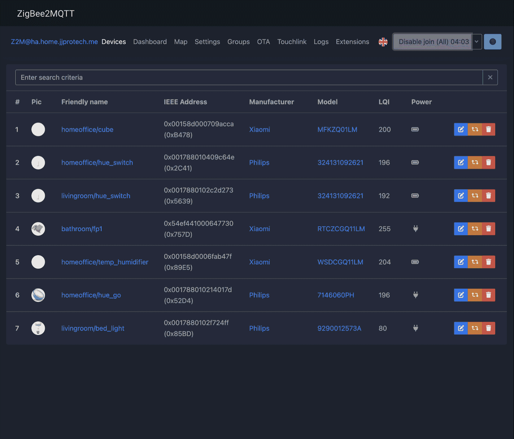

# Aqara Magic Cube T1 Pro External Converter 
[](https://ko-fi.com/jjpro)
[](https://patreon.com/jjpro)

## NOTE

A PR based on this converter is WIP, until it is finalized and officially merged, you may use the external converter file in this repo to make your cube fully function. 

I've been testing this converter for a week, no problems for me. [Report](#issue-report) if it doesn't work for you. 

PRs: 
- Koenkk/zigbee2mqtt.io#1833
- Koenkk/zigbee-herdsman-converters#5367


## Supported Actions

- Operation Mode switch in Zigbee2MQTT
- Scene mode actions: 
  - rotate 
  - shake
  - throw (new action discovered)
  - hold
  - side up 
  - one min inactivity
- Action mode actions: 
  - slide
  - rotate
  - shake
  - throw (new action discovered)
  - tap
  - flip90, flip180
  - one min inactivity

## How to Use 

1. Download `CTPR01.js` and put it in the same directory as Zigbee2MQTT `configuration.yaml` file. 
2. Enable the external converter by adding the following to your Zigbee2MQTT `configuration.yaml`. 
    ```yml
    external_converters:
      - CTPR01.js
    ```
3. Restart Zigbee2MQTT and pairing your device.

If this converter doesn't work, either submit an issue in this repo or discuss [here](https://github.com/Koenkk/zigbee2mqtt/issues/15652).

## Demo 

- pairing

  

- reconfigure 

  
  
- switch mode

  


## Potential Concerns

### 1. write to `0xffc0.0x0009` (aqaraOpple.mode)

```js
configure: async (device, coordinatorEndpoint, logger) => {
  ...
  // attr: 0x0009
  await endpoint.write('aqaraOpple', { mode: 1 }, manufacturerOptions.xiaomi);
  ...
}
```
This line is borrowed from other Xiaomi converters.

I can't find documentation on what `0x0009` (`mode` attribute) on `0xffc0` (`aqaraOpple` cluster) does, but most xiaomi remotes & switches have it in their converter definition. So I left it in for now, and it doesn't seem to cause any problems during my experiment. But Aqara's own hub never writes to this section during the pairing process. I'll probably remove this piece in official release. 


### 2. write to `0xffc0.0x00ff` (aqaraOpple.0x00ff)

```js
configure: async (device, coordinatorEndpoint, logger) => {
  ...
  await endpoint.write('aqaraOpple',
    {
      0x00ff: {
        value: [0x45, 0x65, 0x21, 0x20, 0x75, 0x38, 0x17, 0x69, 0x78, 0x53, 0x89, 0x51, 0x13, 0x16, 0x49, 0x58],
        type: 0x41
      }
    }
    , manufacturerOptions.xiaomi
  );
  ...
}
```

I observed this behavior from sniffing the pairing process with Aqara Hub M2. 

It wrote a different value for each pairing experiment. I randomly picked one to use. Not sure what it does though. 

## Issue Report 

Submit an issue under this repo or continue the discussion [here](https://github.com/Koenkk/zigbee2mqtt/issues/15652).


## SUPPORT MY WORK

This is my first converter ever. In fact, I'm relatively new to HA, Zigbee2MQTT, and Node-red. It took me a lot of effort researching, sniffing, coding, and debugging, and carried exhaustive tests to finetune user prompts when performing configuring and mode switching procedures (see [demos section](#demo)). 

During research, I have taken a course on embeded system development, another course about ZigBee Development (taught by a former Aqara engineer), and spent a lot of time reading ZigBee protocol docs, ZCL library docs etc. 

If the converter is helpful, and want to thank me for my work, consider buying me a coffee or another cube for more fun and testing. ❤️

**Thank You:**

<p>
  &nbsp;&nbsp;&nbsp;<a href="https://ko-fi.com/jjpro">
    
  </a>
</p>
<p>
  &nbsp;&nbsp;&nbsp;<a href="https://patreon.com/jjpro">
    
  </a>
</p>